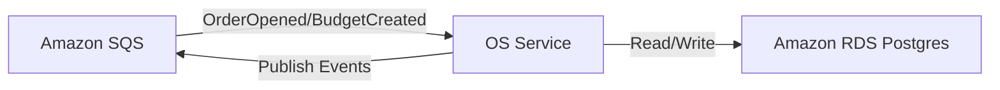
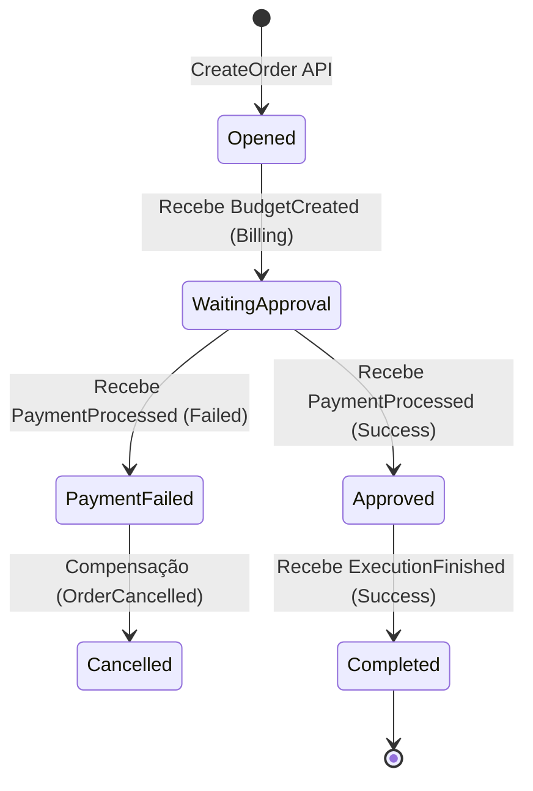

# OSService - Gestão de Ordens de Serviço

Este microsserviço é o "Cérebro" da FiapOficina, responsável por gerenciar o ciclo de vida das Ordens de Serviço.

## 🛠 Funcionalidades
- Abertura de novas Ordens de Serviço.
- Orquestração do status da OS via eventos (SAGA Coreografada).
- Consulta de histórico de ordens por cliente/veículo.

## 🏗 Arquitetura

## 🔄 Fluxo da Saga

O OSService atua como o validador do estado da Ordem de Serviço, reagindo aos eventos dos demais microsserviços:

- **Database**: PostgreSQL (Amazon RDS).
- **Mensageria**: Amazon SQS.
- **Saga**: Consome eventos de orçamento e pagamento para evoluir o status da OS.
- **Status**: Opened, WaitingApproval, Approved, InProgress, Completed, Cancelled.

## 🚀 Pipeline
- Build, Testes Unitários e BDD.
- Análise SonarQube.
- Deploy automático no Amazon EKS.
